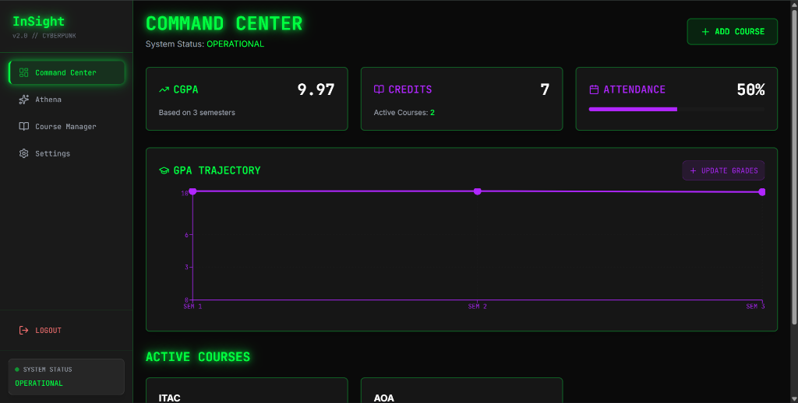
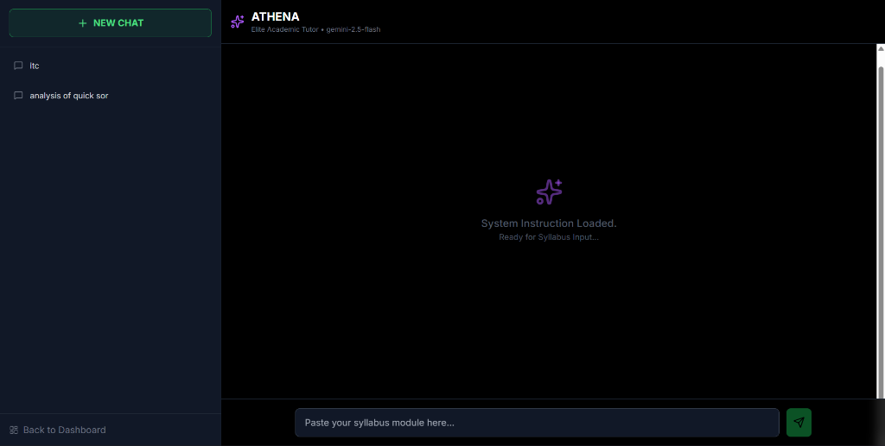
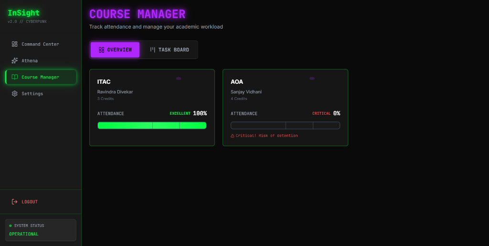
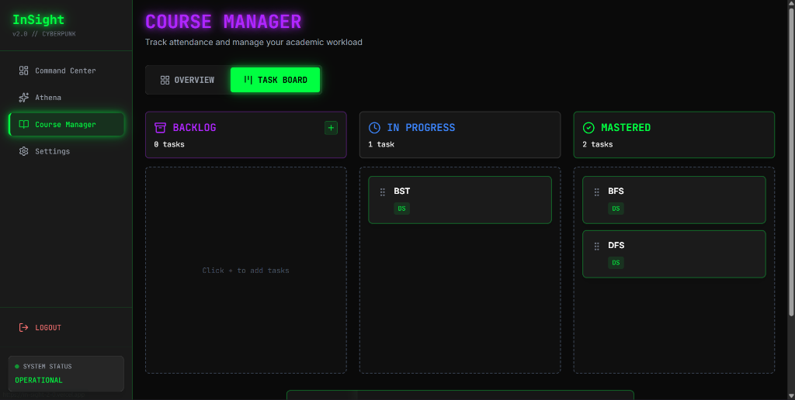
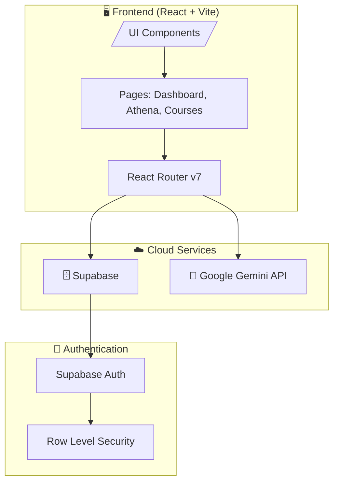

<div align="center">

# ⚡ InSight 2.0

### **📡 Cyberpunk Student Operating System**

[](https://react.dev/)
[](https://www.typescriptlang.org/)
[](https://vitejs.dev/)
[](https://supabase.com/)
[](https://ai.google.dev/)

---

**A full-stack academic operating system with a Netrunner aesthetic—designed to help engineering students track performance, optimize study strategy, and ace exams using AI-generated, syllabus-aware notes.**

[ Documentation](#-table-of-contents) • [🐛 Report Bug](https://github.com/yashkokane1031/InSight-2.0/issues/new?labels=bug) • [✨ Request Feature](https://github.com/yashkokane1031/InSight-2.0/issues/new?labels=enhancement)

</div>

---

## 📸 Screenshots

<div align="center">

### 🎮 Command Center Dashboard


### 🤖 Athena AI Study Companion


### 📚 Course Manager


### 📋 Kanban Task Board


</div>

---

## 📋 Table of Contents

- [🧠 Overview](#-overview)
- [🌟 Key Features](#-key-features)
- [🏗️ System Architecture](#️-system-architecture)
- [🛠️ Tech Stack](#️-tech-stack)
- [📁 Project Structure](#-project-structure)
- [⚡ Quick Start](#-quick-start)
- [🔧 Configuration](#-configuration)
- [🔐 Security](#-security)
- [🗺️ Roadmap](#️-roadmap)
- [🤝 Contributing](#-contributing)
- [📄 License](#-license)
- [👨‍💻 Author](#-author)

---

## 🧠 Overview

**InSight 2.0** is not just another study app—it's a **full-fledged academic operating system** built with a cyberpunk "Netrunner" aesthetic that transforms the way engineering students interact with their academic data.

### 🎯 The Problem
Students often struggle with:
- Fragmented tools for tracking grades, notes, and study progress
- Generic AI assistants that don't understand academic context
- Overwhelming interfaces that slow down productivity

### 💡 The Solution
InSight 2.0 combines **structured academic data**, **real-time AI assistance**, and a **high-density futuristic UI** into a single, focused productivity system that adapts to *your* academic journey.

> *"This is not a chatbot — it's a neural study interface."*

---

## 🌟 Key Features

<table>
<tr>
<td width="50%">

### 🤖 **Athena — AI Study Companion**
- Real-time AI-generated study notes powered by **Google Gemini Pro**
- Structured, syllabus-friendly Markdown output with **LaTeX math support**
- Context-aware responses tailored to your semester and subject depth
- No generic explanations—every response is focused and exam-ready

</td>
<td width="50%">

### 📊 **Command Center Dashboard**
- Bento-grid layout with stunning **glassmorphism UI**
- Real-time CGPA tracking with historical GPA visualization
- Performance analytics powered by **Recharts**
- Designed for quick cognitive parsing, not clutter

</td>
</tr>
<tr>
<td width="50%">

### 📚 **Course Manager**
- End-to-end course lifecycle management
- Drag-and-drop **Kanban board** for task organization
- Subject-wise performance breakdown
- Smart deadline tracking and reminders

</td>
<td width="50%">

### 🔐 **Security-First Design**
- **Supabase Auth** with email/password authentication
- Row Level Security (RLS) on all database tables
- Client-side secrets isolation via environment variables
- Encrypted deployment secrets on Vercel

</td>
</tr>
</table>

---

## 🏗️ System Architecture

InSight 2.0 follows a modern, scalable architecture designed for performance and security.



### Core Layers

| Layer | Technology | Purpose |
|-------|------------|---------|
| **Authentication** | Supabase Auth | Email/password login with custom validation |
| **AI Engine** | Google Gemini Pro | Contextual note generation and Q&A |
| **Database** | Supabase PostgreSQL | Persistent storage with RLS |
| **Frontend** | React 19 + TypeScript | Type-safe, reactive UI |
| **Styling** | Tailwind CSS | Utility-first styling with custom theme |
| **Deployment** | Vercel + GitHub | CI/CD with encrypted secrets |

---

## 🛠️ Tech Stack

### Frontend
| Technology | Version | Purpose |
|------------|---------|---------|
| React | 19.2 | Component-based UI library |
| TypeScript | 5.9 | Type-safe development |
| Vite | 7.2 | Lightning-fast build tool |
| Tailwind CSS | 3.4 | Utility-first CSS framework |
| React Router | 7.12 | Client-side routing |
| Recharts | 3.6 | Data visualization |
| Lucide React | 0.562 | Icon library |

### Backend & Services
| Technology | Purpose |
|------------|---------|
| Supabase | PostgreSQL database + Auth |
| Google Gemini Pro | AI-powered content generation |
| FastAPI | Backend API (optional layer) |

### Developer Experience
| Tool | Purpose |
|------|---------|
| ESLint | Code linting |
| PostCSS | CSS processing |
| pnpm/npm | Package management |

---

## 📁 Project Structure

```
InSight-2.0/
├── 📁 frontend/                 # React + Vite application
│   ├── 📁 src/
│   │   ├── 📁 assets/           # Static assets (images, fonts)
│   │   ├── 📁 components/       # Reusable UI components
│   │   │   ├── KanbanBoard.tsx  # Drag-and-drop task board
│   │   │   ├── ProtectedRoute.tsx # Auth route wrapper
│   │   │   └── Sidebar.tsx      # Navigation sidebar
│   │   ├── 📁 lib/              # Utility libraries
│   │   ├── 📁 pages/            # Main application pages
│   │   │   ├── Athena.tsx       # AI study companion
│   │   │   ├── CourseManager.tsx # Course management
│   │   │   ├── Dashboard.tsx    # Command center
│   │   │   ├── Login.tsx        # Authentication
│   │   │   └── Profile.tsx      # User profile
│   │   ├── App.tsx              # Root component
│   │   ├── App.css              # Global styles
│   │   ├── index.css            # Base styles
│   │   └── main.tsx             # Entry point
│   ├── 📁 public/               # Static public assets
│   ├── index.html               # HTML template
│   ├── package.json             # Dependencies
│   ├── tailwind.config.js       # Tailwind configuration
│   ├── vite.config.ts           # Vite configuration
│   └── tsconfig.json            # TypeScript config
│
├── 📁 backend/                  # FastAPI backend (optional)
│   ├── 📁 app/                  # Application modules
│   ├── requirements.txt         # Python dependencies
│   └── README.md                # Backend documentation
│
├── .gitignore                   # Git ignore rules
└── README.md                    # You are here! 📍
```

---

## ⚡ Quick Start

### Prerequisites

Make sure you have the following installed:
- **Node.js** 18+ (recommended: 20 LTS)
- **npm** or **pnpm**
- **Git**

### 1. Clone the Repository

```bash
git clone https://github.com/yashkokane1031/InSight-2.0.git
cd InSight-2.0
```

### 2. Install Dependencies

```bash
cd frontend
npm install
```

### 3. Configure Environment Variables

Create a `.env.local` file in the `frontend` directory:

```env
# Supabase Configuration
VITE_SUPABASE_URL=your_supabase_project_url
VITE_SUPABASE_ANON_KEY=your_supabase_anon_key

# Google Gemini API
VITE_GEMINI_API_KEY=your_google_ai_studio_api_key
```

> 💡 **Tip:** Get your Supabase keys from [supabase.com](https://supabase.com) and Gemini API key from [Google AI Studio](https://aistudio.google.com/)

### 4. Start Development Server

```bash
npm run dev
```

The app will be running at `http://localhost:5173` 🚀

### 5. Build for Production

```bash
npm run build
npm run preview
```

---

## 🔧 Configuration

### Supabase Database Setup

1. Create a new project at [supabase.com](https://supabase.com)
2. Set up the following tables with RLS enabled:
   - `profiles` - User profile data
   - `courses` - Course information
   - `grades` - Grade records
   - `tasks` - Kanban board tasks

3. Enable Row Level Security (RLS) on all tables
4. Set up foreign key constraints with `ON DELETE CASCADE`

### Tailwind Theme Customization

The cyberpunk theme can be customized in `tailwind.config.js`:

```javascript
// Custom neon colors and glassmorphism utilities
theme: {
  extend: {
    colors: {
      neon: {
        cyan: '#00FFFF',
        magenta: '#FF00FF',
        green: '#39FF14',
      }
    }
  }
}
```

---

## 🔐 Security

InSight 2.0 takes security seriously:

| Feature | Implementation |
|---------|----------------|
| **Authentication** | Supabase Auth with secure session handling |
| **Database Security** | Row Level Security (RLS) policies |
| **API Keys** | Environment variable isolation (`.env.local`) |
| **Deployment Secrets** | Vercel encrypted environment variables |
| **Data Protection** | No sensitive data exposed client-side |
| **Password Validation** | Custom validation rules on signup |

> ⚠️ **Important:** Never commit `.env` files to version control. They are already included in `.gitignore`.

---

## 🗺️ Roadmap

### ✅ Completed
- [x] Core dashboard with CGPA tracking
- [x] Athena AI integration with Gemini Pro
- [x] Supabase authentication
- [x] Course management system
- [x] Kanban task board

### 🔄 In Progress
- [ ] Mobile-responsive optimization
- [ ] Performance analytics enhancements

### 📋 Planned
- [ ] Automated transcript parsing (PDF upload)
- [ ] Integrated Pomodoro study timer with cyberpunk visualizers
- [ ] Advanced predictive analytics
- [ ] Export study notes as PDF
- [ ] Dark/Light theme toggle
- [ ] Offline mode support
- [ ] Browser extension for quick notes

---

## 🤝 Contributing

Contributions are welcome! Here's how you can help:

1. **Fork** the repository
2. **Create** a feature branch (`git checkout -b feature/amazing-feature`)
3. **Commit** your changes (`git commit -m 'Add amazing feature'`)
4. **Push** to the branch (`git push origin feature/amazing-feature`)
5. **Open** a Pull Request

### Development Guidelines

- Follow TypeScript best practices
- Use conventional commit messages
- Write meaningful component documentation
- Test your changes before submitting

---

## 📄 License

This project is licensed under the **MIT License** - see the [LICENSE](LICENSE) file for details.

---

## 👨‍💻 Author

<div align="center">

**Built with 💚 by Yash Kokane**

Engineering Student • Full-Stack Developer • AI Systems Enthusiast

[](https://github.com/yashkokane1031)

---

*"Software should feel intentional. This one does."*

</div>

---

<div align="center">

**⭐ Star this repo if you found it helpful!**

</div>
